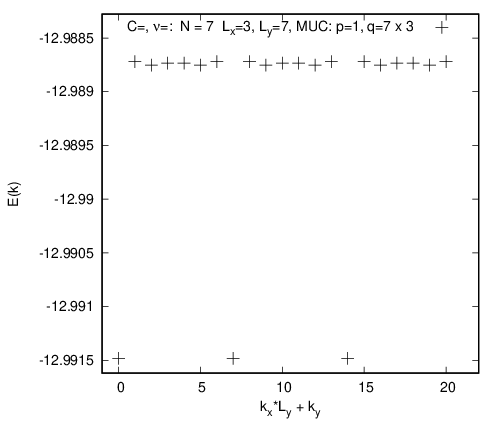
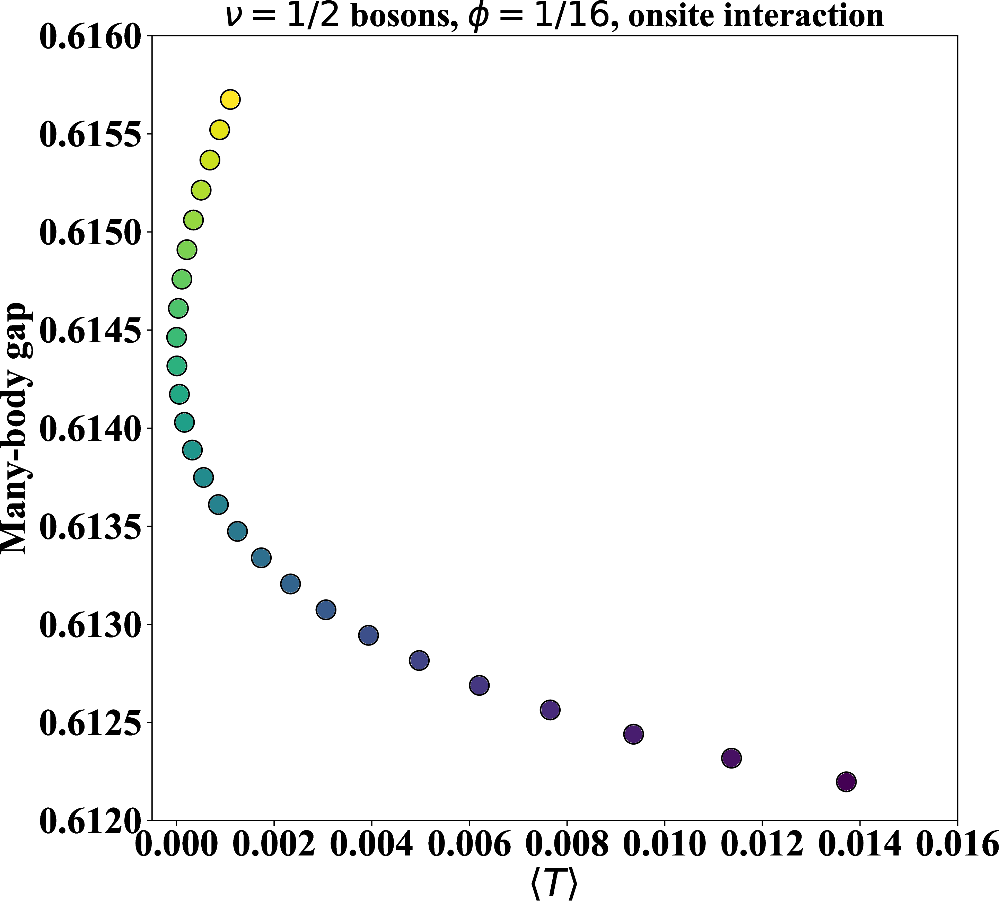
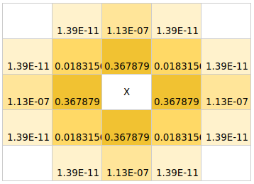

DiagHam_Stability
=================

DiagHam version for the fractional Chern insulator (FCI) stability project.

1. `How this repository was created`_
2. `Getting started with this repository`_
3. `Tutorials`_
4. `References`_
5. `Appendix: DiagHam tips`_
6. `Appendix: Getting started with the latest DiagHam`_
7. `Appendix: Debugging DiagHam compilation`_
8. `Appendix: Boost Python tips`_

How this repository was created
-------------------------------

This repository was created by taking the changes that David Bauer made (relative to revision 3304) and merging them with my current working branch (based on revision 4184).

1) Using the command ``svn info --show-item revision``, I confirmed that David's repository is based on revision 3304 (whereas my working copy is based on revision 4184). For reference, I then used the command ``svn checkout -r 3304 https://www.nick-ux.org/diagham/svn/DiagHam DiagHam_r3304`` to checkout the revision that David originally started with (or the revision closest to the one that he started with, if David took someone else's copy).

2) Performing a ``meld`` between two DiagHam directories is messy because the code formatting style is inconsistent. Specifically, there are often inconsequential file differences due to parenthesis placement, extra whitespace, etc. Therefore, I went to meld>Preferences>Text Filters and selected all of the text filters. Additionally, I added the patterns ``"^.*else.*$"``, ``"^.*if.*$"``, ``"["/+/"]*"``, to ignore lines containing if, else, and other miscellaneous whitespace. This gives a fairly readable comparison. From this, I can see that David's repository has the following files that are modified/new compared to r3304 (important files in bold):

- ``FQHE/src/Architecture/ArchitectureOperation/FQHESquareLatticeMultiBandSymmetrizeU1U1StateOperation.cc(.h)``
- ``FQHE/src/Hamiltonian/ParticleOnTorusDeltaHamiltonian.cc(.h)``
- ``FQHE/src/HilbertSpace/BosonOnSquareLatticeMomentumSpace(Long).h, BosonOnSquareLatticeMultiBandMomentumSpace.cc(.h)``
- ``FQHE/src/Programs/FQHEOnTorus/FQHETorusBosonsDelta.cc, [data file]``

~

- ``FTI/src/Hamiltonian/ParticleOnLatticeHofstadterMultiBandHamiltonian.cc(.h)``, **ParticleOnLatticeHofstadterSingleBandHamiltonian.cc(.h)**, ``ParticleOnLatticeHofstadterSingleBandThreeBodyHamiltonian.cc(.h)``
- ``FTI/src/Programs/FCI/ComputeHofstadterBands(2,Standalone).py``, **FCIHoftsadterModel.cc**, ``FCIHofstadterWithAnyChernModel.cc, FCIRubyLatticeModel.cc, [data files]``
- ``FTI/src/Programs/FTI/[data files]``

~

- ``FTI/src/Tools/FTITightBinding/`` **TightBindingModelHofstadterSquare.cc(.h)**

~

- ``src/Architecture/ArchitectureOperation/AbstractArchitectureOperation.h``

In David's code, he built in the same directory as the source code. Since I try to keep the builds separate to the source (for debugging purposes), I have copied across David's changes with respect to r3304 to my working version (based on r4184).

3) The configure command that David listed in ``configure-command-db`` is...

``./configure CXXFLAGS="-O3 -Wall -I/opt/local/include -I/opt/local/Library/Frameworks/Python.framework/Headers" LDFLAGS="-L/opt/local/lib -L/opt/local/Library/Frameworks/Python.framework/Versions/3.5/lib -flat_namespace -force_flat_namespace -lstdc++ -lboost_python3-mt -lpython3.5" --enable-lapack --with-blas-libs="-lopenblas -lgslcblas" --with-lapack-libs="-llapack -lf2c" --enable-fftw --enable-fqhe --enable-fti``

...adapting this for my computer (UNIX) yields...

``../configure CXXFLAGS="-O3 -Wall -I/usr/include -I/usr/include/python3.8" LDFLAGS="-L/usr/lib -L/usr/lib/python3.8 -L/usr/lib/x86_64-linux-gnu" LIBS="-lpython3.8 -lboost_python -lboost_system -lstdc++ -lfftw3" --enable-lapack --with-blas-libs="-lopenblas -lgslcblas" --with-lapack-libs="-llapack -lf2c" --enable-fftw --enable-fqhe --enable-fti``

My library headers are located in ``/usr/include`` and my library object files are in ``/usr/lib``. Occasionally, symbolic links need to be created for the library object files, so that their name matches the command. Boost python needs to be installed. The "-mt" suffix in the boost_python libraries has been deprecated, since they are now all multi-threading compatible by default. The flat_namespace flags are mac specific, so I have omitted those. Crucially, the library names need to be given in ``LIBS`` so that they are called after the object files -- the order of flags is important!

4) ``ParticleOnLatticeHofstadterSingleBandThreeBodyHamiltonian.cc``  was added to ``FTI/src/Hamiltonian/Makefile.am``

5) ``FTI/src/Programs/FCI/FCIHofstadterCorrelation.cc`` and ``FTI/src/Programs/FCI/FCICheckerboardToHofstadterLatticeModel.cc``, as well as mentions in corresponding ``Makefile.am`` file were removed, for now, due to conflicts

Getting started with this repository
------------------------------------

In the ``~/DiagHam_Stability/trunk`` directory:

1) ``./bootstrap.sh``

2) ``mkdir build; mkdir run; cd build``

3) ``../configure CXXFLAGS="-O3 -Wall -I/usr/include -I/usr/include/python3.8" LDFLAGS="-L/usr/lib -L/usr/lib/python3.8 -L/usr/lib/x86_64-linux-gnu" LIBS="-lpython3.8 -lboost_python -lboost_system -lstdc++ -lfftw3" --enable-lapack --with-blas-libs="-lopenblas -lgslcblas" --with-lapack-libs="-llapack -lf2c" --enable-fftw --enable-fqhe --enable-fti``

4) ``make``

5) ``cd ../run; ../build/FQHE/src/Programs/FQHEOnSphere/FQHESphereJackGenerator --help``

Tutorials
---------

The following tutorials are found in the ``~/DiagHam_Stability/trunk/tutorials`` directory.

Before getting started, the following aliases can be defined in ``~/.bash_aliases``:

- ``alias FTIGetDimension=~/DiagHam_Stability/trunk/build/FTI/src/Programs/FTI/FTIGetDimension``
- ``alias FCIHofstadterModel=~/DiagHam_Stability/trunk/build/FTI/src/Programs/FCI/FCIHofstadterModel``
- ``alias GenericOverlap=~/DiagHam_Stability/trunk/build/src/Programs/GenericOverlap``
- ``alias FindLatticeGap=~/DiagHam_Stability/trunk/scripts_bart/FindLatticeGap.pl``
- ``alias PlotHofstadterSpectrum=~/DiagHam_Stability/trunk/scripts_bart/PlotHofstadterSpectrum.pl``
- ``function vd() { cat $1 | sort -g -k3 | head }``

And the following variable should be added to ``~/.bashrc``:

- ``export PYTHONPATH=$PYTHONPATH:~/DiagHam_Stability/trunk/FTI/src/Programs/FCI``

After which, you need to either ``source ~/.bashrc``, or restart the session, for the changes to take effect.

01_ener_spec
^^^^^^^^^^^^

In this tutorial, we calculate the many-body energy spectrum for a FCI in the Hofstadter model.

1. We can check the dimension of the Hilbert space of our proposed configuration by running:

- ``FTIGetDimension -p 7 -x 3 -y 7``

This shows us that for a fermionic system with 7 particles and 21 magnetic unit cells (yielding nu=7/21=1/3), the Hilbert space dimension is ~1e3, which is easily tractable on a personal computer (anything up to ~1e6 should be fine).

2. In order to generate the energy spectrum for the Hofstadter model, we run the command:

- ``FCIHofstadterModel -p 7 -x 3 -y 7 -X 7 -Y 3 -m 8000 -S --processors 4 -n 1 --lanczos-precision 1e-10 --eigenstate``

We consider the parameters from above with a MUC of 7x3, with 8GB of RAM and 4 processors. Note that a larger MUC yields a physically more stable system, while square total system sizes are numerically the most stable. We can drop the ``--eigenstate`` flag if we're only interested in the energy spectrum. This flag generates the eigenvector(s) corresponding to the lowest eigenvalue(s) in each momentum sector. The ``-n 1`` flag specifies the number of eigenvalues to compute in each momentum sector. Be careful, if you set ``-n 1`` and all of the ground states happen to be in the same momentum sector, you will not find them!

3. Generate and plot the spectrum. (Note that for the ``DiagHam_Stability`` code, the spectrum does not need to be symmetry-extended with the ``-s`` flag, since we compute the spectrum for all momentum sectors, disregarding symmetries, akin to the ``--full-momentum`` flag in ``DiagHam``.)

- ``PlotHofstadterSpectrum *0.dat``

4. Check that the ground state degeneracy is correct in the spectrum. (Note that the magnitude of the energies in ``DiagHam`` is a factor of 2 larger than in ``DiagHam_Stability``.)

- ``vd *0.dat``

5. View the spectrum:

- ``evince *.ps``

6. Determine the many-body gap (Delta):

- ``FindLatticeGap -d 3 *0.dat``

7. Compute the overlap of two ground states:

- ``GenericOverlap -c *kx_0_ky_0.0.vec *kx_1_ky_0.0.vec``

This tutorial is summarized in ``01_ener_spec.sh``.

02_gap_trace
^^^^^^^^^^^^

In this tutorial, we plot the many-body gap (Delta) against the trace inequality saturation measure (TISM, denoted as <T>).

1. Using ``band_geometry.nb`` (dependent on ``BandGeometry.wl``), we can generate the file ``geometry.csv``, which tabulates t2 vs TISM.

- ``cd t2_trace``
- ``mathematica band_geometry.nb``
- ``cd ..``

2. Using ``batch_diagham.py`` together with a parameter file ``batchfile.csv``, we can generate the many-body energy spectra.

- ``cd t2_gap``
- ``python batch_diagham.py batchfile.csv``

3. Using ``batch_getgaps.py`` together with the parameter file ``batchfile.csv``, we can generate the file ``outfile.csv``, which tabulates t2 vs gap. Note that the ``-n`` flag should be large enough to capture the full ground-state degeneracy, in case all ground states are in the same momentum sector. Furthermore, the many-body gap is defined above the highest energy in the quasi-degenerate ground-state manifold. In this boson example, the degeneracy d=2 has not been resolved and so we take the gap above the lowest state.

- ``python batch_getgaps.py batchfile.csv outfile.csv``
- ``cd ..``

4. In the notebook ``final_plot.ipynb``, we can merge the tables of t2 vs TISM vs gap, and plot the result.

- ``jupyter notebook &``

This yields the final plot ``bosons_16_onsite.pdf``, which reproduces Fig.9.(a) of `[Bauer2022] <https://arxiv.org/abs/2110.09565>`__.

03_benchmark
^^^^^^^^^^^^

In this tutorial, we reproduce the nine Delta vs TISM figures in `[Bauer2022] <https://arxiv.org/abs/2110.09565>`__ (Figs.9-11).

Note: The ``t2_gap`` dat files in this tutorial are copied from ``DiagHam_David``, with the following locations:

- Destination: ``bosons_onsite/*.dat``
- Source: ``~/DiagHam_Stability/trunk/FTI/src/Programs/FCI/quartic-bosons/*.dat``

- Destination: ``fermions_NN/*.dat``
- Source 1: ``~/DiagHam_Stability/trunk/FTI/src/Programs/FCI/quartic-data-july/*.dat``
- Source 2: ``~/DiagHam_Stability/trunk/FTI/src/Programs/FCI/quartic-96/*.dat``

- Destination: ``fermions_exp/*.dat``
- Source: ``~/DiagHam_Stability/trunk/FTI/src/Programs/FCI/rsquared-data/*.dat``

While in principle, these dat files could be reproduced by running ``batch_diagham.py``, small differences in DiagHam convergence means that the numbers do not precisely match up. Therefore, in order to reproduce exactly the same figures as `[Bauer2022] <https://arxiv.org/abs/2110.09565>`__, we start with the same dat files.

0. [optional] Generate the many-body energy spectra (modify ``batch_diagham.py`` appropriately) e.g.

- ``cd t2_gap/bosons_onsite``
- ``python ../batch_diagham.py bosons_onsite_batchfile.csv``

1. Calculate the many-body gaps e.g.

- ``python ../batch_getgaps.py 1 bosons_onsite_batchfile.csv bosons_onsite_outfile.csv``

The first argument is the degeneracy of the ground-state manifold. Note that, anomalously, a degeneracy of 1 is used for the boson examples above, since the d=2 degeneracy is not correctly resolved. We can run ``batch_diagham.py`` with a larger ``-n`` in order to resolve this degeneracy. For the fermion examples, the degeneracy is correctly resolved.

2. Generate the band geometry data for bosons (``bosons_geometry.csv``) and fermions (``fermions_geometry.csv``):

- ``cd ../../t2_trace``
- ``mathematica band_geometry.nb``

3. Evaluate the notebook ``final_plots.nb`` to plot the figures:

- ``jupyter notebook &``

Note that for the ``fermions_exp`` figures, the many-body gap had to be further multiplied by a factor of ``1/(2*Area)`` (in the notebook ``final_plots.nb``), where ``Area`` is the area of the system in units of magnetic unit cells. This is for consistency with the other examples, since DiagHam includes a factor of ``1/(2*Area)`` by default in the interaction factors, which was omitted for the custom exponential interaction.

04_int_sym
^^^^^^^^^^

In this tutorial, we demonstrate the effect of interaction symmetry on the stability of FCIs.

The custom interactions are implemented in:

- ``FTI/src/Hamiltonian/ParticleOnLatticeHofstadterSingleBandHamiltonian.cc(.h)``

For example, the non-zero elements of the exp(-r^4) interaction are illustrated below:

1. First, we can check for any discrepancies between ``DiagHam`` and ``DiagHam_Stability`` for the interactions that are implemented in both, using an example for bosons (onsite and NN) and fermions (NN and NNN). For example, we can run ``04_int_sym.sh`` and then compare the spectra, as follows:

- ``./04_int_sym.sh``
- ``vd bosons/diagham_stability/onsite/*.dat; vd bosons/diagham/onsite/*ext.dat``
- ``vd bosons/diagham_stability/NN/*.dat; vd bosons/diagham/NN/*ext.dat``
- ``vd fermions/diagham_stability/NN/*.dat; vd fermions/diagham/NN/*ext.dat``
- ``vd fermions/diagham_stability/NNN/*.dat; vd fermions/diagham/NNN/*ext.dat``

Here we can see that the magnitude of the energies in ``DiagHam`` is a factor of 2 larger than in ``DiagHam_Stability`` but the spectra otherwise agree.

2. Next, we can recover the fermions NN and NNN results above by modifying the hard-coded exp(-r^4) interaction.

3. Finally, we can implement an exp(-r^4) interaction for bosons and modify it to recover the boson onsite and NN results.

References
----------

`[Bauer2016] <https://arxiv.org/abs/1504.07185>`__ "Quantum geometry and stability of the fractional quantum Hall effect in the Hofstadter model", by David Bauer, Tom Jackson, and Rahul Roy, PRB **93**, 235133 (2016).

`[Andrews2018] <https://arxiv.org/abs/1710.09350>`__ "Stability of fractional Chern insulators in the effective continuum limit of Harper-Hofstadter bands with Chern number |C|>1", by Bartholomew Andrews and Gunnar Moller, PRB **97**, 035159 (2018).

`[Bauer2022] <https://arxiv.org/abs/2110.09565>`__ "Fractional Chern insulators with a non-Landau level continuum limit", by David Bauer et al., PRB **105**, 045144 (2022).

Appendix: DiagHam tips
----------------------

- DiagHam wiki: https://nick-ux.org/diagham/index.php/Main_Page
- DiagHam website: http://www.phys.ens.fr/~regnault/diagham/

1) ``Makefile.am`` is user modified, whereas ``Makefile.in`` is created by the compiler

2) You can ``head config.log`` to view the configure command used in the last build

3) You can ``../configure --help`` for useful info about the configure command

4) ``configure.in`` is deprecated in favour of ``configure.ac``

5) always build the code in a separate build directory

Appendix: Getting started with the latest DiagHam
-------------------------------------------------

These instructions are in addition to those listed on the wiki.

1) Intel libraries need to be installed for optimal performance on Intel processors / for MKL workflows. This software is now free to use and no longer requires an academic licence. At the time of writing, you need the Intel oneAPI Base Toolkit for the C/C++ compiler and MKL library and the Intel oneAPI HPC Toolkit for the Fortran compiler and MPI library. After the installation, you can remove the installer if desired, which is in e.g. /tmp/root/ or ~/Downloads/. You can also add the following two lines to your ~/.bashrc: source /opt/intel/oneapi/compiler/latest/env/vars.sh; source /opt/intel/oneapi/mkl/latest/env/vars.sh. This saves some time when starting a shell, compared to sourcing the entire /opt/intel/oneapi/setvars.sh.

2. The configure command to automatically use the latest instruction set (-xHost) is:

../configure --enable-fqhe --enable-fti --enable-lapack --enable-gmp --enable-lapack-only --with-lapack-libs="" --with-blas-libs="-mkl" CC=icc CXX=icpc --enable-debug CFLAGS="-O3 -xHOST" CXXFLAGS="-O3 -xHOST"

...or for using both AVX and AVX2 instruction sets...

../configure --enable-fqhe --enable-fti --enable-lapack --enable-gmp --enable-lapack-only --with-lapack-libs="" --with-blas-libs="-mkl" CC=icc CXX=icpc --enable-debug CFLAGS="-O3 -xAVX -axCORE-AVX2" CXXFLAGS="-O3 -xAVX -axCORE-AVX2"

NB: BLAS will always be called when LAPACK is called, and it contains LAPACK, so no need to duplicate mkl flags. Since MKL is provided by both BLAS and LAPACK, it’s sufficient to give one or the other – but both options are required so one can also cope with separate libraries. The -mkl flag used to be called -lmkl, and it will soon be changed to -qmkl.

A guide to Intel compiler flags can be found here: https://www.bu.edu/tech/support/research/software-and-programming/programming/compilers/intel-compiler-flags/

3. There are several packages from the configure script that may need to be installed before proceeding e.g. f2c, gsl, b2z, etc. Please go through the output of the configure script to check what may be missing, before building.

Appendix: Debugging DiagHam compilation
---------------------------------------

The following hello world examples are found in the ``test`` directory.

boost-helloworld
^^^^^^^^^^^^^^^^

- ``g++ -I/usr/include -I/usr/include/python3.8 -L/usr/lib -L/usr/lib/python3.8 -L/usr/lib/x86_64-linux-gnu PyInitTest.cpp -lpython3.8 -lboost_python -lboost_system``

- ``./a.out``

autotools-helloworld-c
^^^^^^^^^^^^^^^^^^^^^^

Repository found at: https://www.gnu.org/software/automake/manual/html_node/Creating-amhello.html

- ``autoreconf --install``
- ``./configure``
- ``make``
- ``src/hello``

autotools-helloworld-cpp
^^^^^^^^^^^^^^^^^^^^^^^^

Repository found at: https://github.com/jmlamare/autotools-helloworld-cpp

- ``autoreconf --install``
- ``./configure``
- ``make``
- ``src/hello``

Appendix: Boost Python tips
---------------------------

1) Make sure that the ``~/user_config.jam`` is pointing to the correct python interpreter

2) You can install additional packages either via ``pip`` or globally e.g. ``sudo apt-get install python3-scipy``

3) Allow python to load modules from the correct directory by setting ``PYTHONPATH`` before calling ``Py_Initialize()``...

- ``#include <cstdlib> // setenv`` followed by ``setenv("PYTHONPATH", "/home/bart/DiagHam_Stability/trunk/FTI/src/Programs/FCI", 1);`` before ``Py_Initialize()``

...or by appending to the ``PYTHONPATH`` variable.
